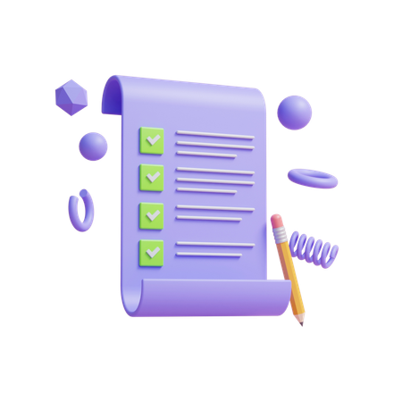

# Task Manager App

## Table of Contents

- [Introduction](#introduction)
- [Features](#features)
- [Installation](#installation)
- [Screenshots](#screenshots)
- [Technologies Used](#technologies-used)

## Introduction

Task Manager App is a simple task manager app designed to help users manage their daily activities and to-dos efficiently. Users can add, edit, delete tasks, assign priorities, set reminders, and view their tasks.

## Features

- User Authentication (Sign up/Login)
- Task Management (Add/Edit/Delete)
- Prioritization (High, Medium, Low)
- Reminders (Set reminders and receive notifications)
- User Preferences (Save notification settings)

## Installation

### Prerequisites

- Flutter SDK: 2.8.1 [Install Flutter](https://flutter.dev/docs/get-started/install)
- IDE (Android Studio, VS Code, etc.): [Install Android Studio](https://developer.android.com/studio) or [Install VS Code](https://code.visualstudio.com/)

### Setup

1. **Clone the repository:**

   git clone [https://github.com/your-username/your-flutter-project.git](https://github.com/bushra-muneer/Task-Manager-App.git)
   cd your-flutter-project

2. **Install dependencies:**

  flutter pub get
  If any error occurs, run:

    flutter clean
    flutter pub get

3.**Run the app:**

Ensure an emulator is running or a physical device is connected.
Run the app using:

flutter run
For physical devices, you can create a build:

flutter build apk

4. **Technologies Used**
Flutter
Dart
Firebase Authentication
Firebase Realtime Database
GetX (State Management)
Shared Preferences (User Preferences)
Local Notifications
